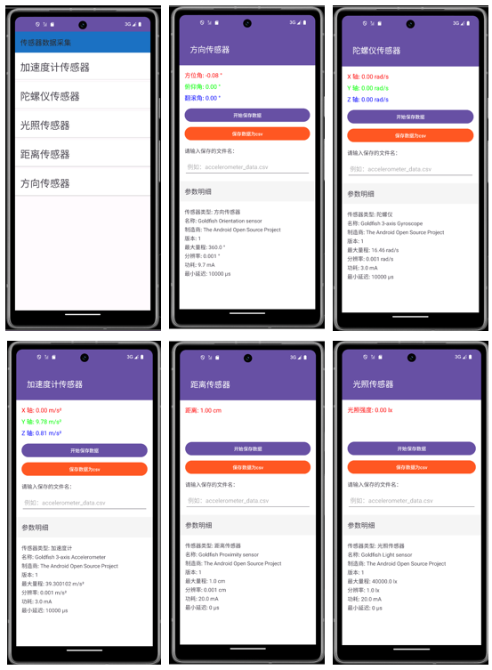

# Sensor-Sense Project Introduction

## I. Project Overview
Sensor-Sense is an Android application designed to collect and record data from various sensors. The app supports common sensors such as accelerometers, orientation sensors, proximity sensors, gyroscopes, and light sensors. Users can not only view the current data of each sensor in real-time but also easily record this data and save it as a CSV file for subsequent data analysis and processing.

## II. Functional Features
1. **Multi-sensor Support**: Covers a variety of common sensors, including accelerometers, orientation sensors, proximity sensors, gyroscopes, and light sensors, fully meeting the data collection needs of different scenarios.
2. **Real-time Data Display**: The application interface displays the current data of each sensor in real-time, allowing users to intuitively understand the real-time status of the sensors.
3. **Data Recording**: Users can start and stop recording sensor data at any time, with simple and convenient operations.
4. **Data Saving**: Records data and saves it as a CSV file.
5. **Parameter Details Display**: Displays detailed parameter information for each sensor, such as name, manufacturer, version, maximum range, etc.

## III. Screenshot

